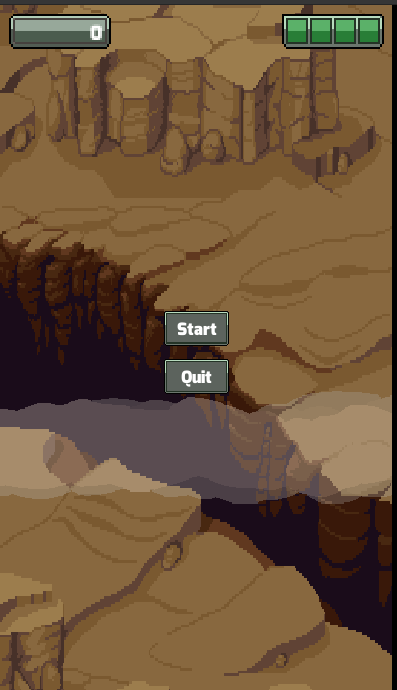
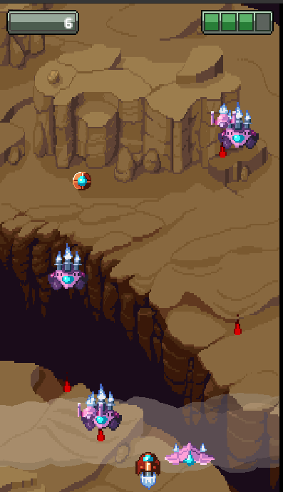
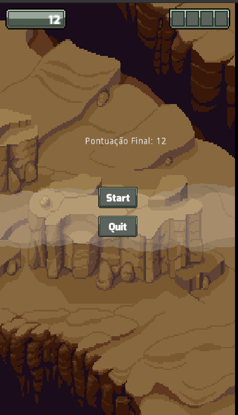

<h1 align="center">Space Shooter</h1>

  
  
  

## Tecnologias

Esse projeto foi desenvolvido com as seguintes tecnologias:

- [Godot Engine](https://godotengine.org/)

## Projeto

Space Shooter é um jogo de plataforma classico, tente destruir o maior número de naves inimigas
e conseguir o maior número de pontos.

## Para rodar o game:

  - Clone o repositorio, depois import o jogo com a Godot
